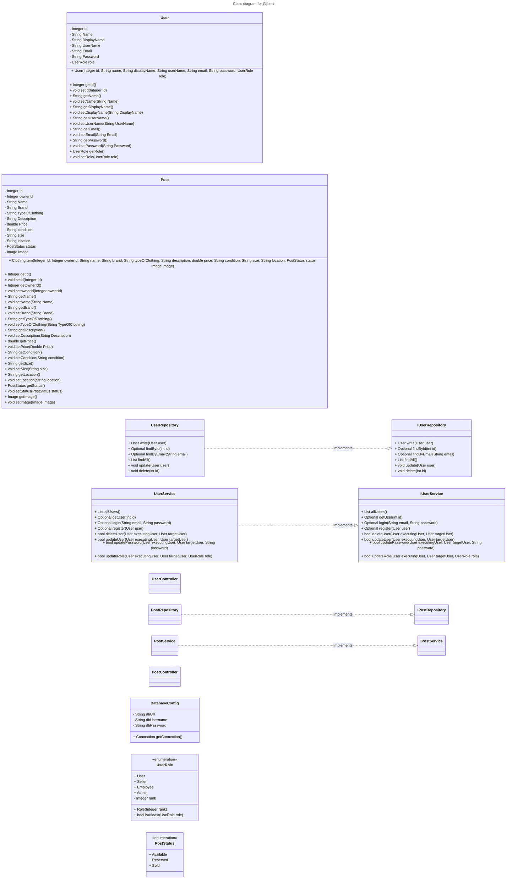

# Class diagram

```mermaid
---
title: Class diagram for Gilbert
---

classDiagram
direction LR
class User {
    - Integer Id
    - String Name
    - String DisplayName
    - String UserName
    - String Email
    - String Password
    - UserRole role
    + User(Integer id, String name, String displayName, String userName, String email, String password, UserRole role)
    + Integer getId()
    + void setId(Integer Id)
    + String getName()
    + void setName(String Name)
    + String getDisplayName()
    + void setDisplayName(String DisplayName)
    + String getUserName()
    + void setUserName(String UserName)
    + String getEmail()
    + void setEmail(String Email)
    + String getPassword()
    + void setPassword(String Password)
    + UserRole getRole()
    + void setRole(UserRole role)   
    
}

class Post {
    - Integer Id
    - Integer ownerId
    - String Name
    - String Brand
    - String TypeOfClothing
    - String Description
    - double Price
    - String condition
    - String size
    - String location
    - PostStatus status
    - Image Image
    + ClothingItem(Integer Id, Integer ownerId, String name, String brand, String typeOfClothing, String description, double price, String condition, String size, String location, PostStatus status Image image)
    + Integer getId()
    + void setId(Integer Id)
    + Integer getownerId()
    + void setownerId(Integer ownerId)
    + String getName()
    + void setName(String Name)
    + String getBrand()
    + void setBrand(String Brand)
    + String getTypeOfClothing()
    + void setTypeOfClothing(String TypeOfClothing)
    + String getDescription()
    + void setDescription(String Description)
    + double getPrice()
    + void setPrice(Double Price)
    + String getCondition()
    + void setCondition(String condition)
    + String getSize()
    + void setSize(String size)
    + String getLocation()
    + void setLocation(String location)
    + PostStatus getStatus()
    + void setStatus(PostStatus status)
    + Image getImage()
    + void setImage(Image Image)    
}

class UserRepository {
    + User write(User user)
    + Optional<User> findById(int id)
    + Optional<User> findByEmail(String email)
    + List<User> findAll()
    + void update(User user)
    + void delete(int id)
}

class IUserRepository {
    + User write(User user)
    + Optional<User> findById(int id)
    + Optional<User> findByEmail(String email)
    + List<User> findAll()
    + void update(User user)
    + void delete(int id)
}

class IUserService {
    + List<User> allUsers()
    + Optional<User> getUser(int id)
    + Optional<User> login(String email, String password)
    + Optional<User> register(User user)
    + bool deleteUser(User executingUser, User targetUser)
    + bool updateUser(User executingUser, User targetUser)
    + bool updatePassword(User executingUser, User targetUser, String password)
    + bool updateRole(User executingUser, User targetUser, UserRole role)
}

class UserService {
    + List<User> allUsers()
    + Optional<User> getUser(int id)
    + Optional<User> login(String email, String password)
    + Optional<User> register(User user)
    + bool deleteUser(User executingUser, User targetUser)
    + bool updateUser(User executingUser, User targetUser)
    + bool updatePassword(User executingUser, User targetUser, String password)
    + bool updateRole(User executingUser, User targetUser, UserRole role)
}

class UserController {
    
}

class IPostRepository {
    
}

class PostRepository {
    
}

class IPostService {
    
}

class PostService {
    
}

class PostController {
    
}


class DatabaseConfig {
    - String dbUrl
    - String dbUsername
    - String dbPassword
    + Connection getConnection()
}


class UserRole {
    <<enumeration>>
    + User
    + Seller
    + Employee
    + Admin
    
    - Integer rank
    + Role(Integer rank)
    + bool isAtleast(UseRole role)
}

class PostStatus {
    <<enumeration>>
    + Available
    + Reserved
    + Sold
}


%% Interface implementations
    UserService ..|> IUserService : Implements
    UserRepository ..|> IUserRepository : Implements
    PostService ..|> IPostService : Implements
    PostRepository ..|> IPostRepository :Implements

%% Dependency injections


%% Relationships

```
