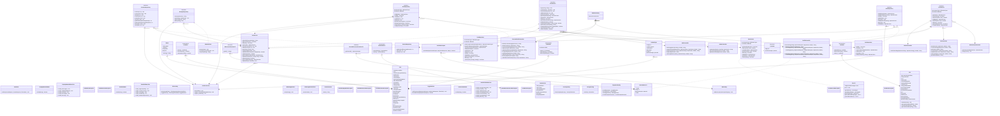

# Class diagram

```mermaid
---
title: Class diagram for Gilbert
---

classDiagram
direction LR
class User {
    - Integer Id
    - String Name
    - String DisplayName
    - String UserName
    - String Email
    - String Password
    - UserRole role
    - Integer numberOfSales
    + User(Integer id, String name, String displayName, String userName, String email, String password, UserRole role, Integer numberOfSales)
    + Integer getId()
    + void setId(Integer Id)
    + String getName()
    + void setName(String Name)
    + String getDisplayName()
    + void setDisplayName(String DisplayName)
    + String getUserName()
    + void setUserName(String UserName)
    + String getEmail()
    + void setEmail(String Email)
    + String getPassword()
    + void setPassword(String Password)
    + UserRole getRole()
    + void setRole(UserRole role)   
    + Integer getNumberOfSales()
    + void setNumberOfSales(Integer numberOfSales)
    
}

class Post {
    - Integer Id
    - Integer ownerId
    - String Name
    - String Brand
    - String TypeOfClothing
    - String Description
    - double Price
    - String condition
    - String size
    - String location
    - PostStatus status
    - String ImageId
    - LocalDate datePostedAt
    + ClothingItem(Integer Id, Integer ownerId, String name, String brand, String typeOfClothing, String description, double price, String condition, String size, String location, PostStatus status, Image image, LocalDate dateOfPost)
    + Integer getId()
    + void setId(Integer Id)
    + Integer getownerId()
    + void setownerId(Integer ownerId)
    + String getName()
    + void setName(String Name)
    + String getBrand()
    + void setBrand(String Brand)
    + String getTypeOfClothing()
    + void setTypeOfClothing(String TypeOfClothing)
    + String getDescription()
    + void setDescription(String Description)
    + double getPrice()
    + void setPrice(Double Price)
    + String getCondition()
    + void setCondition(String condition)
    + String getSize()
    + void setSize(String size)
    + String getLocation()
    + void setLocation(String location)
    + PostStatus getStatus()
    + void setStatus(PostStatus status)
    + Image getImage()
    + void setImage(Image Image)    
    + LocalDate getDateOfPost()
    + void setDateOfPost(LocalDate dateOfPost)
}

class UserRepository {
    + User write(User user)
    + Optional<User> findById(int id)
    + Optional<User> findByEmail(String email)
    + List<User> findAll()
    + void update(User user)
    + void delete(int id)
}

class IUserRepository {
    + User write(User user)
    + Optional<User> findById(int id)
    + Optional<User> findByEmail(String email)
    + List<User> findAll()
    + void update(User user)
    + void delete(int id)
}

class IUserService {
    + List<User> allUsers()
    + Optional<User> getUser(int id)
    + Optional<User> login(String email, String password)
    + Optional<User> register(User user)
    + bool deleteUser(User executingUser, User targetUser)
    + bool updateUser(User executingUser, User targetUser)
    + bool updatePassword(User executingUser, User targetUser, String password)
    + bool updateRole(User executingUser, User targetUser, UserRole role)
}

class UserService {
    + List<User> allUsers()
    + Optional<User> getUser(int id)
    + Optional<User> login(String email, String password)
    + Optional<User> register(User user)
    + bool deleteUser(User executingUser, User targetUser)
    + bool updateUser(User executingUser, User targetUser)
    + bool updatePassword(User executingUser, User targetUser, String password)
    + bool updateRole(User executingUser, User targetUser, UserRole role)
}

class UserController {
    + getUser(@PathVariable int id)
    + getAllUsers()
    + updateUser(@PathVariable int id, @RequestBody User user)
    + deleteUser(@PathVariable int id)
    + updatePassword(@PathVariable int id, @RequestBody String password)
    + updateRole(@PathVariable int id, @RequestBody UserRole role)
}

class IPostRepository {
    + Post write(Post post)
    + Optional<Post> findById(int id)
    + Optional<Post> findByOwnerId(String ownerId)
    + List<Post> findAll()
    + List<Post> findAllByOwnerId()
    + void update(Post post)
    + void delete(int id)
}

class PostRepository {
    + Post write(Post post)
    + Optional<Post> findById(int id)
    + List<Post> findAll()
    + List<Post> findAllByOwnerId(String ownerId)
    + void update(Post post)
    + void delete(int id)
}

class IPostService {
    + Post createPost(Post post);
    + Optional<Post> getPostById(int id);
    + List<Post> getPostsByOwnerId(String ownerId);
    + List<Post> getAllPosts();
    + void updatePost(Post post);
    + void deletePost(int id);
    + void markAsSold(int postId);
    + void markAsReserved(int postId)
}

class PostService {
    + Post createPost(Post post);
    + Optional<Post> getPostById(int id);
    + List<Post> getPostsByOwnerId(String ownerId);
    + List<Post> getAllPosts();
    + void updatePost(Post post);
    + void deletePost(int id);
    + void markAsSold(int postId);
    + void markAsReserved(int postId)
}

class PostController {
    + createPost(@RequestBody Post post)
    + getAllPosts()
    + getPostById(@PathVariable int id)
    + updatePost(@PathVariable int id, @RequestBody Post post)
    + deletePost(@PathVariable int id)
    + markAsSold(@PathVariable int postId)
    + markAsReserved(@PathVariable int postId)
}


class DatabaseConfig {
    - String dbUrl
    - String dbUsername
    - String dbPassword
    + Connection getConnection()
}


class UserRole {
    <<enumeration>>
    + User
    + Seller
    + Employee
    + Admin
    
    - Integer rank
    + Role(Integer rank)
    + bool isAtleast(UseRole role)
}

class PostStatus {
    <<enumeration>>
    + Available
    + Reserved
    + Sold
}


%% Interface implementations
    UserService ..|> IUserService : Implements
    UserRepository ..|> IUserRepository : Implements
    PostService ..|> IPostService : Implements
    PostRepository ..|> IPostRepository :Implements

%% Dependency injections
    UserController --> UserService
    UserService --> IUserRepository
    PostController --> PostService
    PostService --> IPostRepository

%% Relationships
    User "1" --> "many" Post : owns
    Post --> User : ownerId (via id)
    Post "1" -- "1" PostStatus : "has a status"
    User "1" -- "1" UserRole : "has a role"
    

```

```mermaid 
classDiagram
direction BT
class AdminController {
  + updateUserRole(int, UserRole, HttpSession) String
  + getUsersPage(HttpSession, Model) String
  + getAdminPanel(HttpSession, Model) String
}
class AuthController {
  + authPage(Optional~String~, Model) String
  + registerRequest(RegisterUser, Optional~String~, HttpSession, Model) String
  + loginRequest(String, String, Optional~String~, HttpSession, Model) String
  + logout(HttpSession) String
  + authPageRedirect(String, Optional~String~, Model) String
}
class AuthFilter {
  + doFilter(ServletRequest, ServletResponse, FilterChain) void
}
class Brand {
  - String name
  - Integer id
  + toString() String
   String name
   Integer id
}
class Condition {
<<enumeration>>
  + values() Condition[]
  + valueOf(String) Condition
  + isAtLeast(Condition) boolean
}
class DatabaseConfig {
   Connection connection
}
class DisplayNameValidator {
  + isValid(String) boolean
}
class DisplayNameValidatorTest {
  + isValid_maxLength() void
  + isValid_validDisplayName() void
  + isValid_tooShort() void
  + isValid_minLength() void
  + isValid_tooLong() void
}
class EmailInUseException
class EmailNotFoundException
class EmailValidator {
  + isValid(String) boolean
}
class EmailValidatorTest {
  + isValid_edgeCaseMail() void
  + isValid_zeroDotThrows() void
  + isValid_missingAt() void
  + isValid_validEmail() void
  + isValid_multipleAtSeperators() void
}
class FavoriteRepository {
  + getNumberOfFavoritesByPost(int) int
  + remove(int, int) void
  + insert(int, int) void
}
class FilterConfig {
  + authenticateFilter() FilterRegistrationBean~AuthFilter~
  + loggedInFilter() FilterRegistrationBean~LoggedInFilter~
}
class GeneralNode~T~ {
  - T value
   Integer id
   Optional~Integer~ parentId
   T value
}
class GilbertApplication {
  + main(String[]) void
}
class GilbertApplicationTests {
  ~ contextLoads() void
}
class GlobalControllerAdvice {
  + getCurrentUser(HttpSession) Optional~User~
  + categoryTree() Tree
}
class HomeController {
  + home() String
}
class IFavoriteRepository {
<<Interface>>
  + remove(int, int) void
  + remove(User, Post) void
  + insert(int, int) void
  + remove(User, int) void
  + remove(int, Post) void
  + insert(int, Post) void
  + getNumberOfFavoritesByPost(int) int
  + getNumberOfFavoritesByPost(Post) int
  + insert(User, Post) void
  + insert(User, int) void
}
class IPostRepository {
<<Interface>>
  + findById(int) Optional~Post~
  + findAll() List~Post~
  + write(Post) Post
  + update(Post) void
  + delete(int) void
  + getUserFavorites(User) List~Post~
  + getUserFavorites(int) List~Post~
  + search(String, String[], String[]) List~Post~
  + findByOwnerId(int) List~Post~
   List~ProductType~ allProductTypes
   List~Brand~ allBrands
}
class IPostService {
<<Interface>>
  + getPost(int) Optional~Post~
  + search(String) List~Post~
  + deletePost(User, Post) boolean
  + findById(int) Optional~Post~
  + editPost(User, Post) boolean
  + allPosts() List~Post~
  + getPostsByOwner(int) List~Post~
  + createPost(Post) Optional~Post~
   List~ProductType~ allProductTypes
   List~Brand~ allBrands
}
class IStorageRepository {
<<Interface>>
  + store(InputStream) String
  + store(String, InputStream) void
  + objectUrl(String) String
  + delete(String) void
}
class IUserRepository {
<<Interface>>
  + findByEmail(String) Optional~User~
  + findByField(String, String) Optional~User~
  + findAll() List~User~
  + update(User) void
  + write(User) User
  + findByUsername(String) Optional~User~
  + delete(int) void
  + findById(int) Optional~User~
}
class IUserService {
<<Interface>>
  + login(String, String) User
  + updateRole(int, UserRole) void
  + removeFavorite(User, int) void
  + addFavorite(User, int) void
  + getFavorites(User) List~Post~
  + getUserByEmail(String) Optional~User~
  + getUser(int) Optional~User~
  + allUsers() List~User~
  + getUserByUsername(String) Optional~User~
  + updateUser(User) boolean
  + updatePassword(User, String, String) boolean
  + getProfilePictureUrl(String) String
  + updateProfilePicture(User, MultipartFile) boolean
  + register(RegisterUser) User
  + deleteUser(User) boolean
}
class IdAccessorFunction~T~ {
<<Interface>>
  + getId(T) Integer
}
class InvalidDisplayNameException
class InvalidEmailFormatException
class InvalidPasswordException
class InvalidPasswordFormatException
class LoggedInFilter {
  + doFilterInternal(HttpServletRequest, HttpServletResponse, FilterChain) void
  # shouldNotFilter(HttpServletRequest) boolean
}
class MinioS3Client {
  + delete(String) void
  + store(String, InputStream) void
  + objectUrl(String) String
}
class ParentIdAccessorFunction~T~ {
<<Interface>>
  + getParentId(T) Optional~Integer~
}
class PasswordError {
<<enumeration>>
  + valueOf(String) PasswordError
  + values() PasswordError[]
}
class PasswordValidator {
  + isValid(String) boolean
}
class PasswordValidatorTest {
  + isValid_missingLowerCase() void
  + isValid_tooShort() void
  + isValid_validPassword() void
  + isValid_missingUpperCase() void
  + isValid_minimumViable() void
  + isValid_missingNumber() void
  + isValid_allErrors() void
}
class PersonalProfileController {
  + deleteAccountSetting(HttpSession) String
  + deleteFavorite(int, HttpSession) String
  + accountSettingsPage(HttpSession, Model) String
  + addFavorite(int, HttpSession) String
  + updateProfilePicture(MultipartFile, HttpSession) String
  + settingsPage(HttpSession, Model) String
  + profilePage(HttpSession, Model) String
  + updateDetails(String, String, HttpSession) String
  + favorite(HttpSession, Model) String
  + updatePasswordSetting(String, String, HttpSession) String
}
class Post {
  - Condition condition
  - int id
  - ProductType typeOfClothing
  - double price
  - String name
  - String imageId
  - String ownerDisplayName
  - Date datePostedAt
  - int ownerId
  - Brand brand
  - String location
  - PostStatus status
  - String size
  - String description
   String description
   String location
   int ownerId
   Brand brand
   ProductType typeOfClothing
   double price
   Optional~String~ imageId
   String size
   String name
   int id
   Date datePostedAt
   PostStatus status
   String ownerDisplayName
   Condition condition
}
class PostController {
  + deletePost(int, HttpSession, Model) String
  + createPostPage(HttpSession, Model) String
  + getPost(int, Model) String
  + createPost(Post, HttpSession, Model) String
  + updatePost(int, Post, HttpSession, Model) String
  + editPostPage(int, HttpSession, Model) String
  + getAllPosts(Model) String
}
class PostRepository {
  - productTypeFromResultSet(ResultSet) Optional~ProductType~
  - brandFromResultSet(ResultSet) Optional~Brand~
  ~ postFromResultSet(ResultSet) Optional~Post~
  + findByOwnerId(int) List~Post~
  + update(Post) void
  + write(Post) Post
  + findAll() List~Post~
  + findById(int) Optional~Post~
  + getUserFavorites(int) List~Post~
  + delete(int) void
  + search(String, String[], String[]) List~Post~
   List~ProductType~ allProductTypes
   List~Brand~ allBrands
}
class PostService {
  + getPostsByOwner(int) List~Post~
  + editPost(User, Post) boolean
  + createPost(Post) Optional~Post~
  + deletePost(User, Post) boolean
  + allPosts() List~Post~
  + findById(int) Optional~Post~
  + getPost(int) Optional~Post~
  + search(String) List~Post~
   List~ProductType~ allProductTypes
   List~Brand~ allBrands
}
class PostStatus {
<<enumeration>>
  + values() PostStatus[]
  + valueOf(String) PostStatus
  + isAtLeast(PostStatus) boolean
   PostStatus default
}
class PostWriteException
class ProductType {
  - Integer id
  - Integer parentId
  - String name
   String name
   Integer id
   Optional~Integer~ parentId
}
class ProfileController {
  + favoritesPage(String, HttpServletRequest, HttpSession, Model) String
  + profilePicture(HttpServletRequest) String
  + postsPage(String, HttpServletResponse, HttpServletRequest, HttpSession, Model) String
  + salesPage(String, HttpServletResponse, HttpServletRequest, HttpSession, Model) String
  + profilePage(HttpServletResponse, HttpServletRequest, HttpSession, Model) String
  + ordersPage(String, HttpServletResponse, HttpServletRequest, HttpSession, Model) String
}
class ProfileInterceptor {
  + preHandle(HttpServletRequest, HttpServletResponse, Object) boolean
}
class RegisterUser {
  - String password
  - String email
  - String displayName
   String password
   boolean acceptedTerms
   String email
   String displayName
}
class SearchController {
  + mainSearchPage(Optional~String~, Optional~String[]~, Model) String
}
class SecurityConfig {
  + filterChain(HttpSecurity) SecurityFilterChain
}
class StorageConfig {
  + s3Client() MinioClient
}
class ThymeleafConfig {
  + localeResolver() LocaleResolver
  + layoutDialect() LayoutDialect
  + messageSource() MessageSource
  + localeChangeInterceptor() LocaleChangeInterceptor
}
class Tree~T~ {
  - SequencedSet~Integer~ roots
  - getChildren(T) Set~Integer~
  - getChildren(Integer) Set~Integer~
  + getNode(Integer) Optional~T~
  + getChildrenNodes(Integer) List~T~
  + getChildrenNodes(T) List~T~
   List~T~ roots
}
class TreeNode {
<<Interface>>
   Integer id
   Optional~Integer~ parentId
}
class User {
  - Date termsAcceptedDate
  - String username
  - int id
  - String email
  - String displayName
  - String profilePictureId
  - UserRole role
  - String passwordHash
  + hashPassword() void
  + generateUsernameSuffix(int) String
  + checkPassword(String) boolean
  + generateUsername(String) String
   String passwordHash
   String password
   Date termsAcceptedDate
   int id
   String email
   UserRole role
   String username
   String displayName
   Optional~String~ profilePictureId
}
class UserNotFoundException
class UserRepository {
  + findAll() List~User~
  + delete(int) void
  ~ userFromResultSet(ResultSet) Optional~User~
  + update(User) void
  + write(User) User
  + findByField(String, String) Optional~User~
}
class UserRole {
<<enumeration>>
  + valueOf(String) UserRole
  + isAtLeast(UserRole) boolean
  + values() UserRole[]
}
class UserService {
  + getProfilePictureUrl(String) String
  + getFavorites(User) List~Post~
  + allUsers() List~User~
  + getUser(int) Optional~User~
  + removeFavorite(User, int) void
  + addFavorite(User, int) void
  + login(String, String) User
  + register(RegisterUser) User
  + updateProfilePicture(User, MultipartFile) boolean
  + updateUser(User) boolean
  + getUserByUsername(String) Optional~User~
  + updatePassword(User, String, String) boolean
  + deleteUser(User) boolean
  + getUserByEmail(String) Optional~User~
  + updateRole(int, UserRole) void
}
class UserServiceTest {
  + beforeEach() void
  + register_throwsEmailAlreadyInUser() void
  + register_validUser() void
}
class UserWriteException
class WebConfig {
  + addInterceptors(InterceptorRegistry) void
}

AdminController "1" *--> "userService 1" IUserService 
AuthController "1" *--> "userService 1" IUserService 
FavoriteRepository "1" *--> "databaseConfig 1" DatabaseConfig 
FavoriteRepository  ..>  IFavoriteRepository 
GeneralNode~T~ "1" *--> "idAccessor 1" IdAccessorFunction~T~ 
GeneralNode~T~ "1" *--> "parentIdAccessor 1" ParentIdAccessorFunction~T~ 
GeneralNode~T~  ..>  TreeNode 
GlobalControllerAdvice "1" *--> "postService 1" IPostService 
InvalidPasswordFormatException "1" *--> "errors *" PasswordError 
MinioS3Client  ..>  IStorageRepository 
PersonalProfileController "1" *--> "userService 1" IUserService 
Post "1" *--> "brand 1" Brand 
Post "1" *--> "condition 1" Condition 
Post "1" *--> "status 1" PostStatus 
Post "1" *--> "typeOfClothing 1" ProductType 
PostController "1" *--> "postService 1" IPostService 
PostRepository "1" *--> "databaseConfig 1" DatabaseConfig 
PostRepository  ..>  IPostRepository 
PostService "1" *--> "postRepository 1" IPostRepository 
PostService  ..>  IPostService 
ProfileController "1" *--> "postService 1" IPostService 
ProfileController "1" *--> "userService 1" IUserService 
ProfileInterceptor "1" *--> "userService 1" IUserService 
SearchController "1" *--> "postService 1" IPostService 
Tree~T~  ..>  TreeNode 
User "1" *--> "role 1" UserRole 
UserRepository "1" *--> "databaseConfig 1" DatabaseConfig 
UserRepository  ..>  IUserRepository 
UserService "1" *--> "favoriteRepository 1" IFavoriteRepository 
UserService "1" *--> "postRepository 1" IPostRepository 
UserService "1" *--> "storageRepository 1" IStorageRepository 
UserService "1" *--> "userRepository 1" IUserRepository 
UserService  ..>  IUserService 
UserServiceTest "1" *--> "mockFavoriteRepo 1" IFavoriteRepository 
UserServiceTest "1" *--> "mockPostRepo 1" IPostRepository 
UserServiceTest "1" *--> "mockStorRepo 1" IStorageRepository 
UserServiceTest "1" *--> "mockRepo 1" IUserRepository 
UserServiceTest "1" *--> "userService 1" UserService 
WebConfig "1" *--> "profileInterceptor 1" ProfileInterceptor 
```
