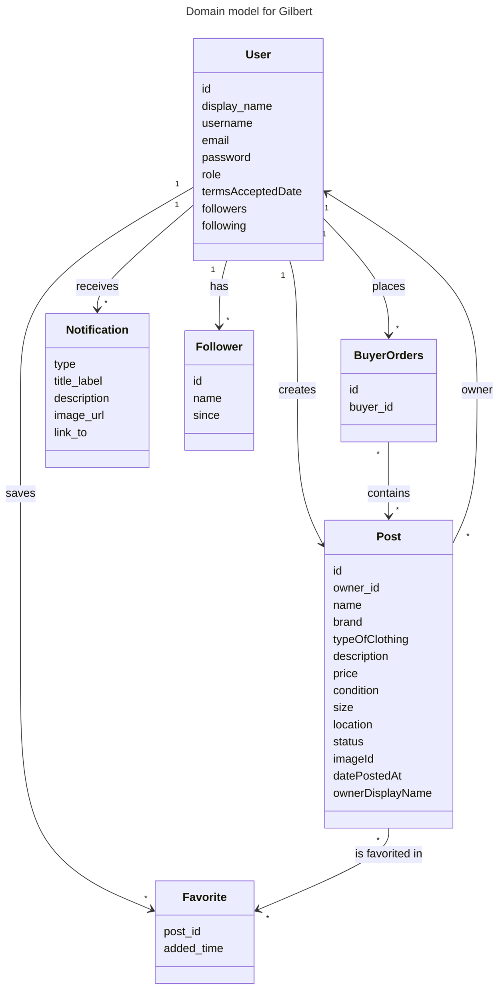

 # Domain model

```mermaid
---
title: Domain model for Gilbert
---

classDiagram
class User {
    id
    display_name
    username
    email
    password
    role
    termsAcceptedDate
    followers
    following
}

class Post {
    id
    owner_id
    name
    brand
    typeOfClothing
    description
    price
    condition
    size
    location
    status
    imageId
    datePostedAt
    ownerDisplayName
}

class BuyerOrders {
    id
    buyer_id

}

class Notification {
    type
    title_label
    description
    image_url
    link_to
}

class Follower {
    id
    name
    since
}

class Favorite {
    post_id
    added_time
}

    User "1" --> "*" Post : creates
    User "1" --> "*" BuyerOrders : places
    User "1" --> "*" Notification : receives
    User "1" --> "*" Follower : has
    User "1" --> "*" Favorite : saves

    Post "*" --> "*" Favorite : is favorited in
    Post "*" --> "1" User : owner
    BuyerOrders "*" --> "*" Post : contains
```
