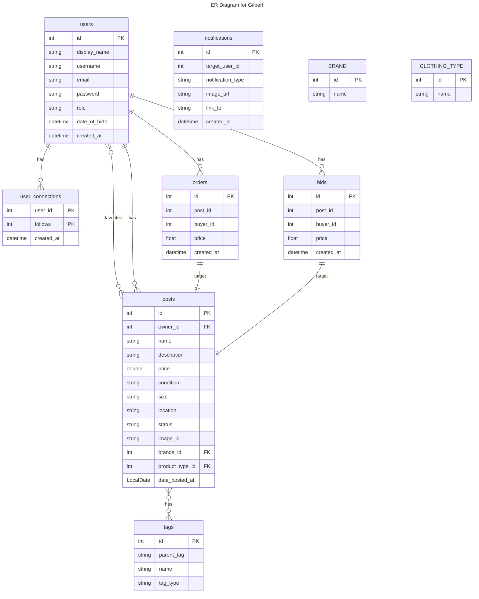

# ER-diagram

```mermaid
---
title: ER Diagram for Gilbert
---

erDiagram
users {
    int id PK
    string display_name
    string username
    string email
    string password
    string role
    datetime date_of_birth
    datetime created_at
}

user_connections {
    int user_id PK
    int follows PK
    datetime created_at
}

posts {
    int id PK
    int owner_id FK
    string name
    string description
    double price
    string condition
    string size
    string location
    string status
    string image_id
    int brands_id FK
    int product_type_id FK
    LocalDate date_posted_at
}

orders {
    int id PK
    int post_id
    int buyer_id
    float price
    datetime created_at
}

bids {
    int id PK
    int post_id
    int buyer_id
    float price
    datetime created_at
}

notifications {
    int id PK
    int target_user_id
    string notification_type
    string image_url
    string link_to
    datetime created_at
}

tags {
    int id PK
    string parent_tag
    string name
    string tag_type
}

BRAND {
    int id PK
    string name
}

CLOTHING_TYPE {
    int id PK
    string name
}
        


users }o--o{ posts : "favorites"
users ||--o{ user_connections : "has"
users ||--o{ posts : "has"
users ||--o{ orders : "has"
users ||--o{ bids : "has"

posts }o--o{ tags : "has"

orders ||--|| posts : "target"
bids ||--|| posts : "target"
```
