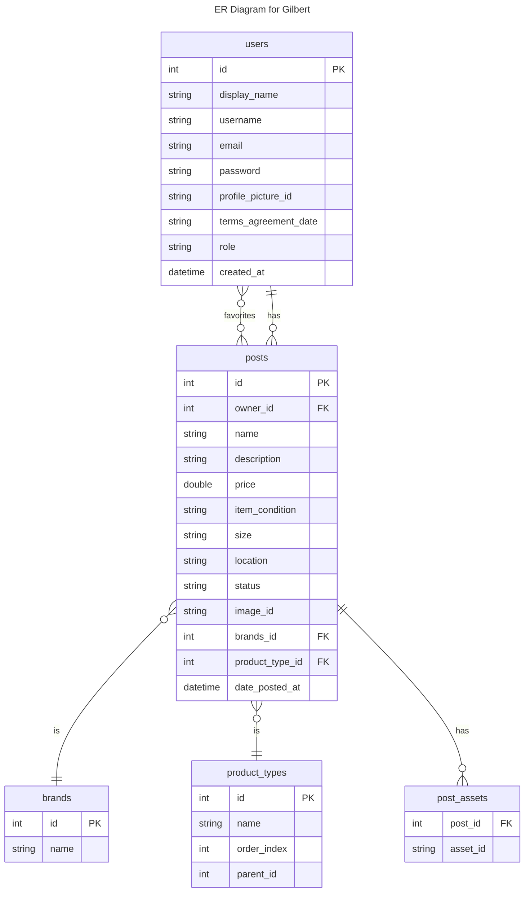

# ER-diagram

```mermaid
---
title: ER Diagram for Gilbert
---

erDiagram
users {
    int id PK
    string display_name
    string username
    string email
    string password
    string profile_picture_id 
    string terms_agreement_date
    string role
    datetime created_at
}

brands {
    int id PK
    string name
}

product_types {
    int id PK
    string name
    int order_index
    int parent_id
}

posts {
    int id PK
    int owner_id FK
    string name
    string description
    double price
    string item_condition
    string size
    string location
    string status
    string image_id
    int brands_id FK
    int product_type_id FK
    datetime date_posted_at
}

post_assets {
    int post_id FK
    string asset_id
}

users }o--o{ posts : "favorites"
users ||--o{ posts : "has"

posts }o--|| brands : "is"
posts }o--|| product_types : "is"
posts ||--o{ post_assets : "has"
```
