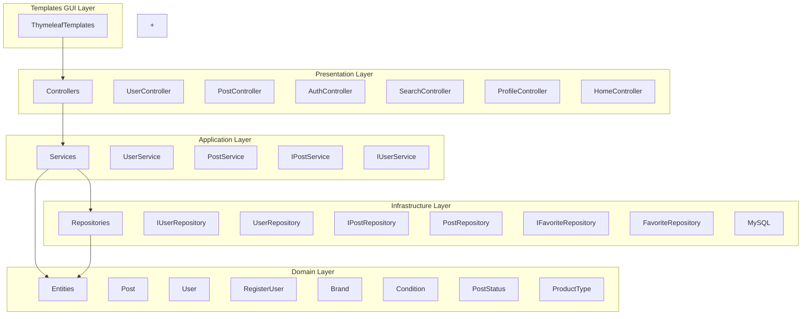

# PackageDiagram



## 🧠 Lag-forklaring

| Lag | Indhold | Funktion |
|-----|---------|----------|
| **Templates (GUI)** | Thymeleaf HTML-filer | Præsenterer data for brugeren |
| **Presentation Layer** | Controllers | Behandler HTTP-forespørgsler, videresender til services og returnerer views |
| **Application Layer** | Services | Indeholder forretningslogik og koordination |
| **Domain Layer** | Entities | Repræsenterer kerneobjekter og domænemodellen |
| **Infrastructure Layer** | Repositories, MySQL | Dataadgang og vedvarende lagring (database) |
```
