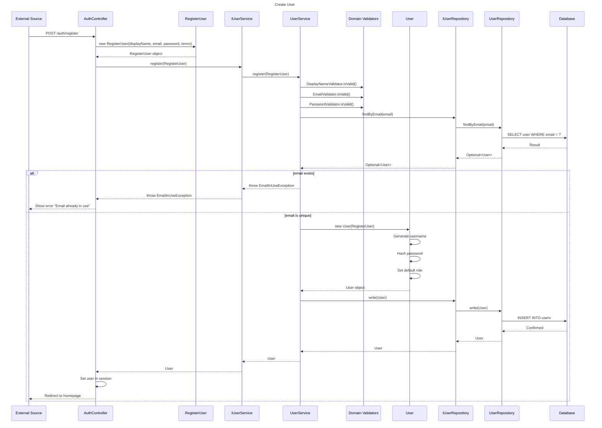
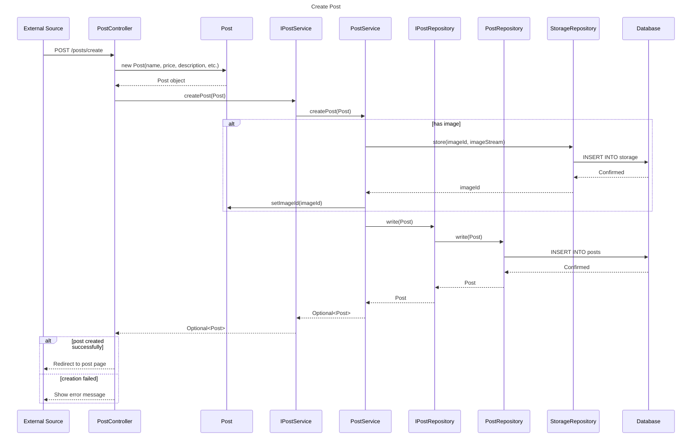
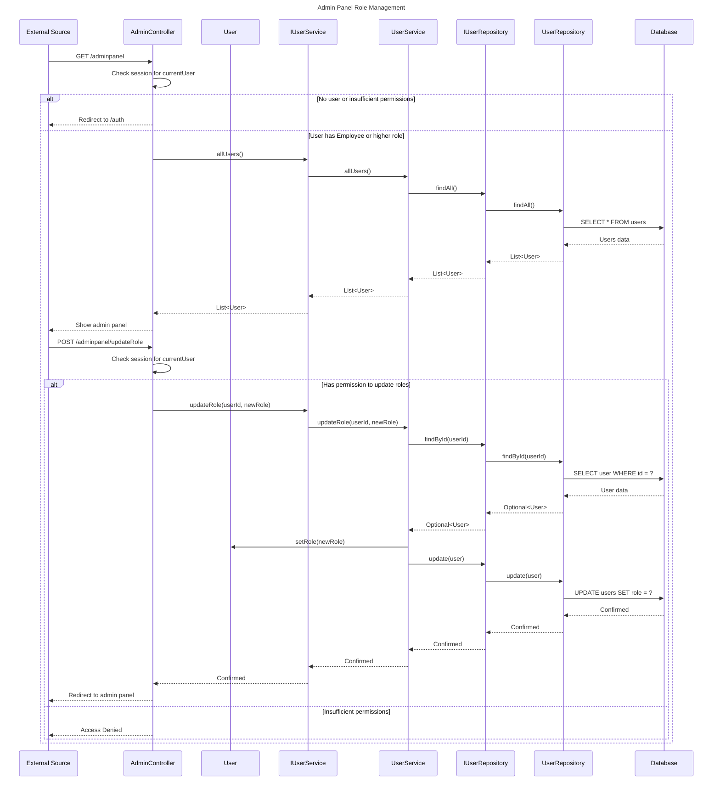
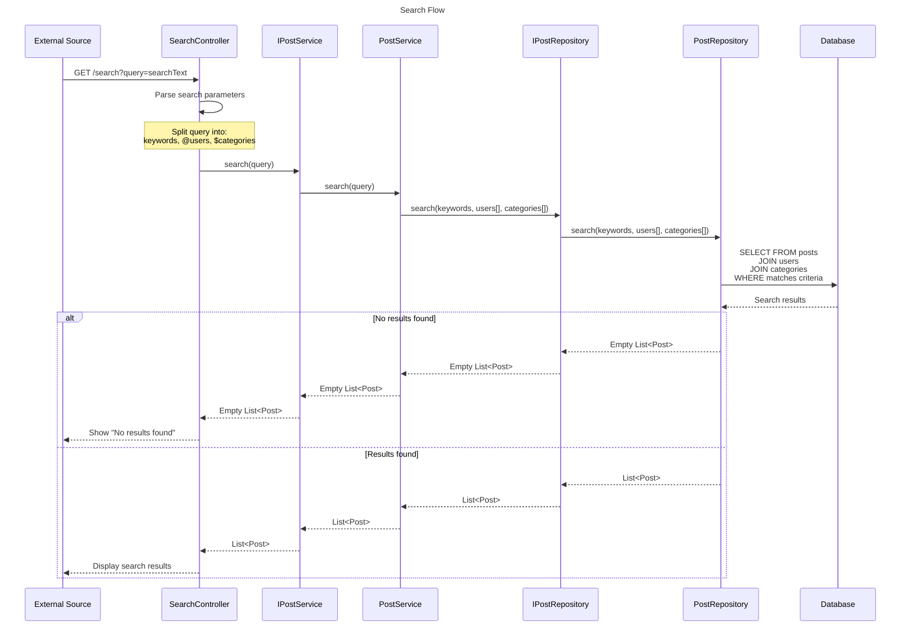

```mermaid
sequenceDiagram
    title Create User
    participant External Source
    participant AC as AuthController
    participant RU as RegisterUser
    participant IUS as IUserService
    participant US as UserService
    participant DV as Domain Validators
    participant User
    participant IUR as IUserRepository
    participant UR as UserRepository
    participant DB as Database

    External Source->>AC: POST /auth/register
    AC->>RU: new RegisterUser(displayName, email, password, terms)
    RU-->>AC: RegisterUser object
    AC->>IUS: register(RegisterUser)
    IUS->>US: register(RegisterUser)

    US->>DV: DisplayNameValidator.isValid()
    US->>DV: EmailValidator.isValid()
    US->>DV: PasswordValidator.isValid()

    US->>IUR: findByEmail(email)
    IUR->>UR: findByEmail(email)
    UR->>DB: SELECT user WHERE email = ?
    DB-->>UR: Result
    UR-->>IUR: Optional<User>
    IUR-->>US: Optional<User>

    alt email exists
        US-->>IUS: throw EmailInUseException
        IUS-->>AC: throw EmailInUseException
        AC-->>External Source: Show error "Email already in use"
    else email is unique
        US->>User: new User(RegisterUser)
        User->>User: Generate username
        User->>User: Hash password
        User->>User: Set default role
        User-->>US: User object

        US->>IUR: write(User)
        IUR->>UR: write(User)
        UR->>DB: INSERT INTO users
        DB-->>UR: Confirmed
        UR-->>IUR: User
        IUR-->>US: User
        US-->>IUS: User
        IUS-->>AC: User
        AC->>AC: Set user in session
        AC-->>External Source: Redirect to homepage
    end
    
```

```mermaid
sequenceDiagram
title Create Post
participant External Source
participant PC as PostController
participant Post
participant IPS as IPostService
participant PS as PostService
participant IPR as IPostRepository
participant PR as PostRepository
participant SR as StorageRepository
participant DB as Database

    External Source->>PC: POST /posts/create
    PC->>Post: new Post(name, price, description, etc.)
    Post-->>PC: Post object
    
    PC->>IPS: createPost(Post)
    IPS->>PS: createPost(Post)
    
    alt has image
        PS->>SR: store(imageId, imageStream)
        SR->>DB: INSERT INTO storage
        DB-->>SR: Confirmed
        SR-->>PS: imageId
        PS->>Post: setImageId(imageId)
    end
    
    PS->>IPR: write(Post)
    IPR->>PR: write(Post)
    PR->>DB: INSERT INTO posts
    DB-->>PR: Confirmed
    PR-->>IPR: Post
    IPR-->>PS: Post
    PS-->>IPS: Optional<Post>
    IPS-->>PC: Optional<Post>
    
    alt post created successfully
        PC-->>External Source: Redirect to post page
    else creation failed
        PC-->>External Source: Show error message
    end


```

```mermaid

sequenceDiagram
title Admin Panel Role Management
participant External Source
participant AC as AdminController
participant User
participant IUS as IUserService
participant US as UserService
participant IUR as IUserRepository
participant UR as UserRepository
participant DB as Database

    External Source->>AC: GET /adminpanel
    
    AC->>AC: Check session for currentUser
    
    alt No user or insufficient permissions
        AC-->>External Source: Redirect to /auth
    else User has Employee or higher role
        AC->>IUS: allUsers()
        IUS->>US: allUsers()
        US->>IUR: findAll()
        IUR->>UR: findAll()
        UR->>DB: SELECT * FROM users
        DB-->>UR: Users data
        UR-->>IUR: List<User>
        IUR-->>US: List<User>
        US-->>IUS: List<User>
        IUS-->>AC: List<User>
        AC-->>External Source: Show admin panel
        
        External Source->>AC: POST /adminpanel/updateRole
        AC->>AC: Check session for currentUser
        
        alt Has permission to update roles
            AC->>IUS: updateRole(userId, newRole)
            IUS->>US: updateRole(userId, newRole)
            US->>IUR: findById(userId)
            IUR->>UR: findById(userId)
            UR->>DB: SELECT user WHERE id = ?
            DB-->>UR: User data
            UR-->>IUR: Optional<User>
            IUR-->>US: Optional<User>
            
            US->>User: setRole(newRole)
            US->>IUR: update(user)
            IUR->>UR: update(user)
            UR->>DB: UPDATE users SET role = ?
            DB-->>UR: Confirmed
            UR-->>IUR: Confirmed
            IUR-->>US: Confirmed
            US-->>IUS: Confirmed
            IUS-->>AC: Confirmed
            AC-->>External Source: Redirect to admin panel
        else Insufficient permissions
            AC-->>External Source: Access Denied
        end
    end
```

```mermaid
sequenceDiagram
title Search Flow
participant External Source
participant SC as SearchController
participant IPS as IPostService
participant PS as PostService
participant IPR as IPostRepository
participant PR as PostRepository
participant DB as Database

    External Source->>SC: GET /search?query=searchText
    SC->>SC: Parse search parameters
    Note over SC: Split query into:<br/>keywords, @users, $categories
    
    SC->>IPS: search(query)
    IPS->>PS: search(query)
    PS->>IPR: search(keywords, users[], categories[])
    IPR->>PR: search(keywords, users[], categories[])
    
    PR->>DB: SELECT FROM posts<br/>JOIN users<br/>JOIN categories<br/>WHERE matches criteria
    DB-->>PR: Search results
    
    alt No results found
        PR-->>IPR: Empty List<Post>
        IPR-->>PS: Empty List<Post>
        PS-->>IPS: Empty List<Post>
        IPS-->>SC: Empty List<Post>
        SC-->>External Source: Show "No results found"
    else Results found
        PR-->>IPR: List<Post>
        IPR-->>PS: List<Post>
        PS-->>IPS: List<Post>
        IPS-->>SC: List<Post>
        SC-->>External Source: Display search results
    end
```
